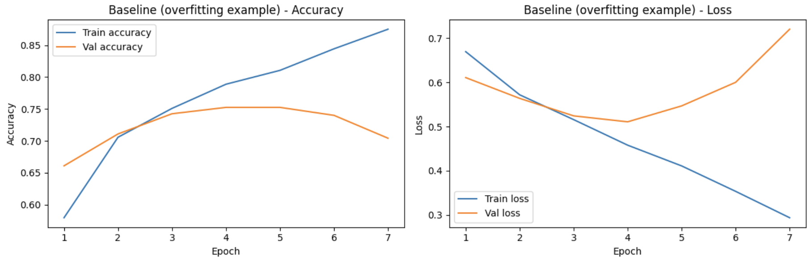
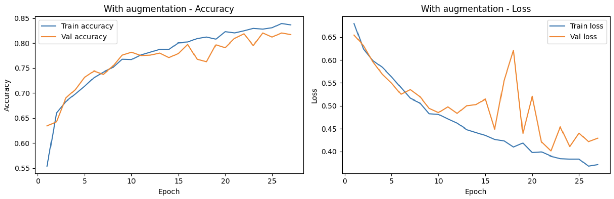
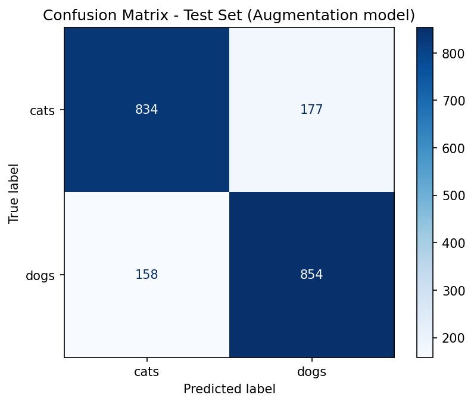
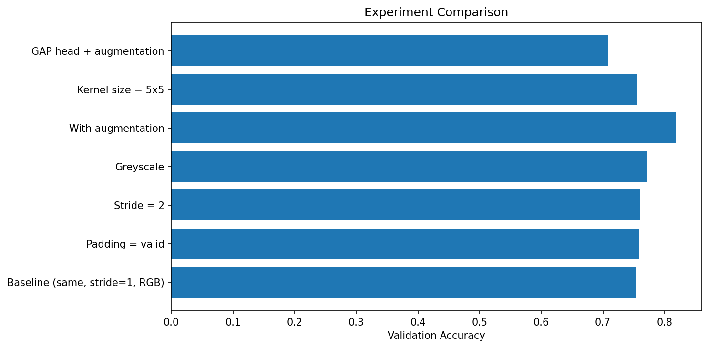

# Cat vs Dog Classifier — CNN from Scratch (TensorFlow/Keras)

A binary image classifier distinguishing cats from dogs, built as a learning project to understand core CNN concepts — kernels, convolution, ReLU, padding, stride, pooling, and data augmentation — through direct experimentation rather than just following a tutorial.

Built with TensorFlow/Keras. Dataset: [Cat and Dog (Kaggle)](https://www.kaggle.com/datasets/tongpython/cat-and-dog).

## Key finding

**Data augmentation was the single most impactful change tested.** A baseline model overfit badly (96% train accuracy vs ~75% validation accuracy, with validation loss climbing after epoch 5). Adding augmentation alone closed most of that gap and pushed validation accuracy to ~82%, confirmed by a final unbiased test accuracy of **83.44%**.

Architectural tweaks (padding, stride, kernel size) had comparatively minor effects — a reminder that for a small dataset like this, *how you train* mattered more than *how you shape the network*.

## Results

| Experiment | Val Accuracy | Val Loss | Parameters |
|---|---|---|---|
| Baseline (same padding, stride=1, RGB) | 75.25% | 0.511 | 134,721 |
| Padding = valid | 75.83% | 0.503 | 130,241 |
| Stride = 2 | 76.00% | 0.508 | 93,761 |
| Greyscale | 77.25% | 0.498 | 134,145 |
| **Data augmentation** | **81.83%** | **0.401** | 134,721 |
| Kernel size = 5x5 | 75.50% | 0.518 | 300,097 |
| GlobalAveragePooling head + augmentation | 70.83% | 0.556 | 93,377 |

**Final test set evaluation (winning model — augmentation):**
- Test accuracy: **83.44%**
- F1-score: 0.83 (both classes)
- Balanced performance — no meaningful bias toward either class






## What was tested and why

Each experiment changed exactly one variable against a fixed baseline (padding=same, stride=1, kernel=3x3, RGB, no augmentation), so results are directly comparable:

- **Padding (same vs valid)** — whether border pixels are preserved via zero-padding.
- **Stride (1 vs 2)** — how far the kernel moves per step; higher stride = fewer parameters, coarser feature detection.
- **Color (RGB vs greyscale)** — tested because EDA showed near-identical pixel intensity distributions between cats and dogs, suggesting color wasn't a strong distinguishing signal. Confirmed: greyscale nearly matched RGB.
- **Kernel size (3x3 vs 5x5)** — larger kernels see a wider neighborhood per scan, at the cost of more parameters.
- **Data augmentation** — random flips, rotations, zoom, and contrast shifts applied on-the-fly during training, to fight the overfitting seen in the baseline.
- **Classifier head (Flatten+Dense vs GlobalAveragePooling)** — GAP is a common modern alternative to Flatten, but underperformed here (70.83% vs 81.83%), likely because this shallow 3-layer network still relies on spatial information that GAP discards.

## Project structure

```
cat-dog-cnn/
├── README.md
├── notebook.ipynb
├── requirements.txt
├── results/
│   └── results_summary.csv
└── images/
    ├── sample_cats.png
    ├── sample_dogs.png
    ├── augmentation_examples.png
    ├── baseline_curves.png
    ├── augmentation_curves.png
    ├── gap_head_curves.png
    ├── confusion_matrix.png
    └── experiment_comparison.png
```

## Methodology notes

- Dataset split: train/validation/test with validation held out specifically to guide experiment comparisons, keeping the test set untouched until final evaluation — avoiding indirect overfitting to test data through repeated experimentation.
- Early stopping (patience 3–5, restoring best weights) used throughout to compare each configuration at its best point rather than an arbitrary final epoch.
- All training done on Google Colab (T4 GPU).

## Limitations

- Each experiment is a single training run; small differences (e.g. padding same vs valid, within ~1 point) are within normal run-to-run variance from random weight initialization rather than necessarily meaningful effects. Only the augmentation result (a ~5-6 point jump) is large enough to be a confident finding.
- No cross-validation was used, due to time/compute constraints.
- Per course structure, Dense layer theory was intentionally not covered in depth yet — a single-neuron output layer was used as the minimum necessary classifier head, with GlobalAveragePooling explored separately as a Dense-minimizing alternative.

## Running it

```bash
pip install -r requirements.txt
```

Open `notebook.ipynb` in Jupyter or Google Colab. Dataset must be downloaded separately from Kaggle and placed/extracted as described in the notebook's setup cells.
